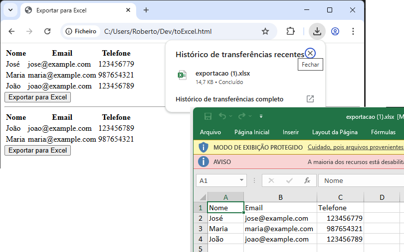

# ExportTableHtml2Excel
Exemplo de tabelas em HTML que por meio de uma função Javascript exporta a tabela selecionada para um arquivo em EXCEL

> [!CAUTION]
> Biblioteca 
> https://cdnjs.cloudflare.com/ajax/libs/xlsx/0.16.9/xlsx.full.min.js


As tabelas devem ter um ID


Função js **exportToExcel** receberá o **id** da tabela.


```html
    <table id="tbl1">
        <tr>
            <th>Nome</th>
            <th>Email</th>
            <th>Telefone</th>
        </tr>
        <tr>
            <td>José</td>
            <td>jose@example.com</td>
            <td>123456779</td>
        </tr>
        <tr>
            <td>Maria</td>
            <td>maria@example.com</td>
            <td>987654321</td>
        </tr>
        <tr>
            <td>João</td>
            <td>joao@example.com</td>
            <td>123456789</td>
        </tr>
    </table>
    <button onclick="exportToExcel('tbl1')">Exportar para Excel</button>
```


```javascript
    <script>
        function exportToExcel(tab) {
            var tabela = document.getElementById(tab);
            var planilha = XLSX.utils.table_to_book(tabela, {sheet: "Sheet 1"});
            XLSX.write(planilha, {bookType: 'xlsx', bookSST: true, type: 'binary'});
            XLSX.writeFile(planilha, 'exportacao.xlsx');
        }
    </script>
```


